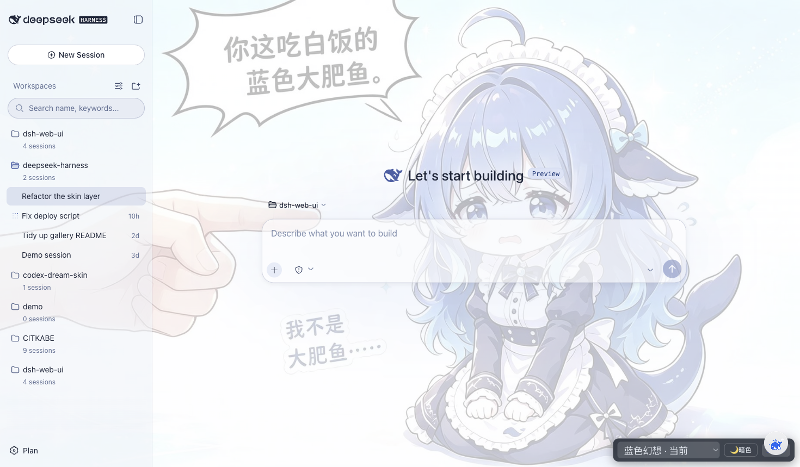
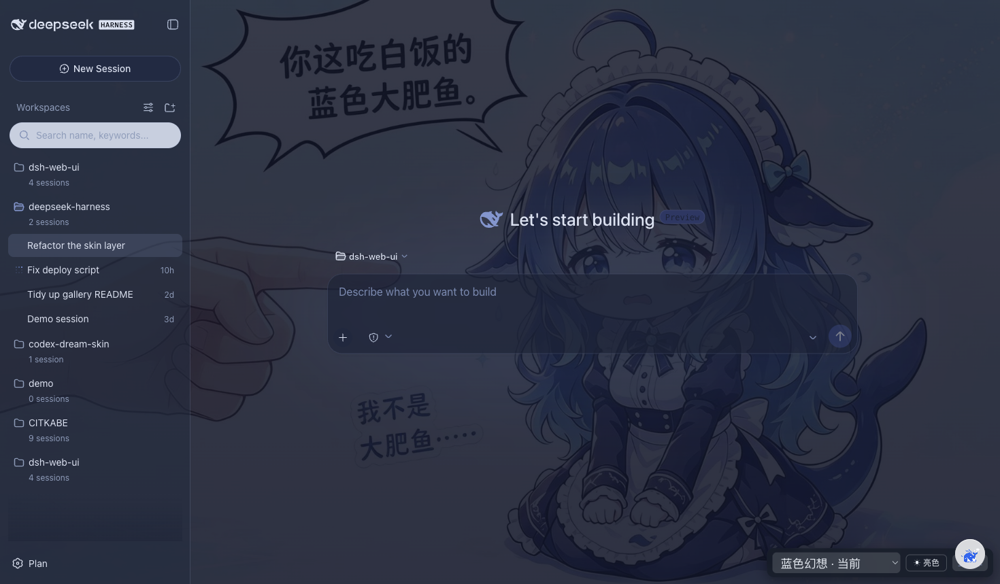
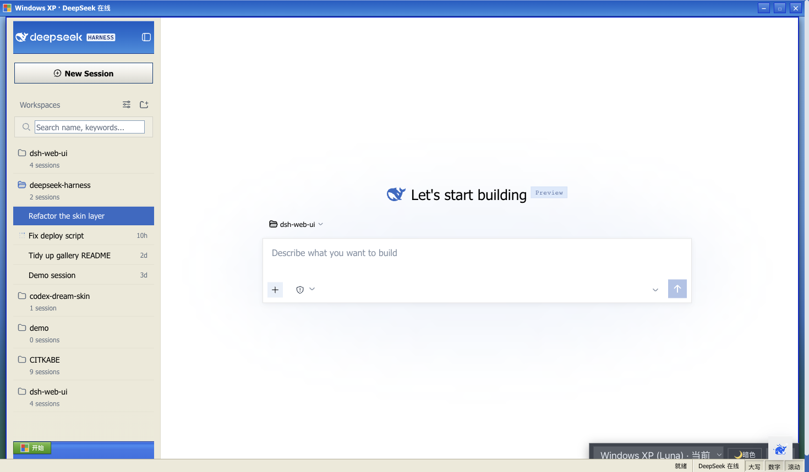
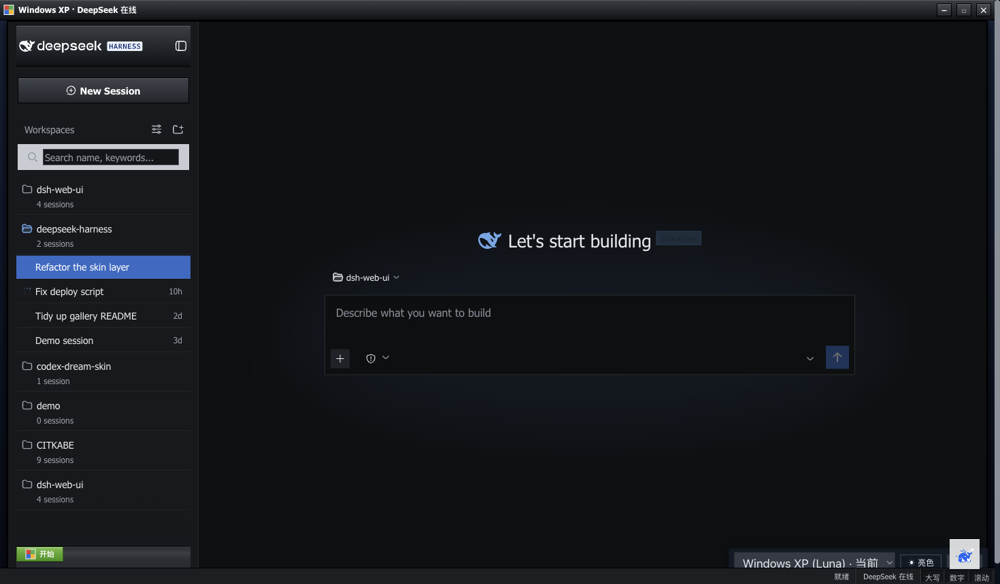
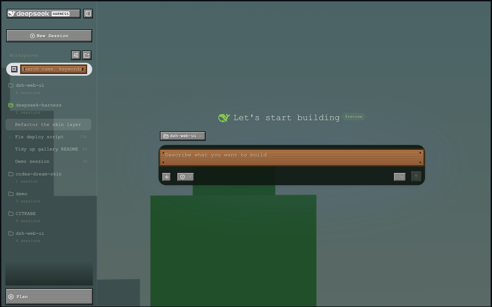
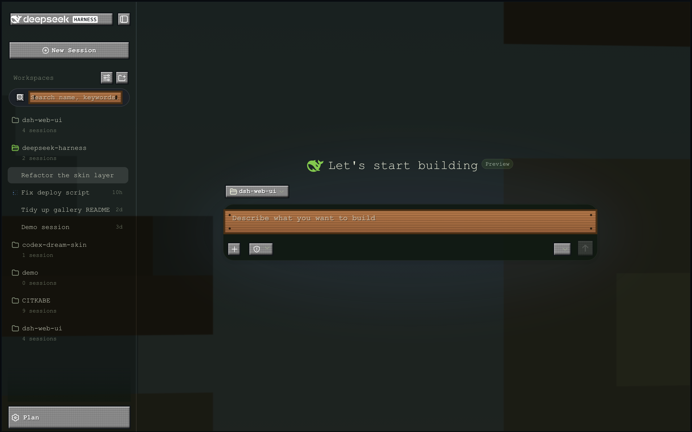

# dsh-web-ui · DSH Web GUI Plugin Family

[中文](README.md) | English

dsh-web-ui is the plugin family monorepo for the DeepSeek Harness (DSH) Web GUI: `packages/` hosts feature plugins and the skin collection. Every plugin is an official-standard bundle (`dsh.bundle.patch` manifest + `cordis.patch.yml` plugin row) and installs independently, while aggregate packages (`web-ui-all` / `dsh-skins`) install everything in one shot.

> This repository is private to the `dsh-external` organization. Organization members only. Never commit credentials, keys, or sensitive material.

## Highlights

- Family monorepo: feature plugins and the skin collection live in one repo; every package installs standalone, or all at once via the aggregate packages
- Official-standard bundles: each package follows the DSH profile/bundle convention and works directly with `dsh plugin --profile web add ...`
- Plugin settings in the web GUI: feature-plugin configuration is editable from Settings > Plugin config (the same card experience as the built-in Shell / Agent loop / Web search), applied live
- Skin center: skin exclusivity is maintained in the managed section of `~/.dsh/cordis.patch.yml`; `dsh-skin use` switches instantly
- Try-on preview: `gallery/preview.html` renders every skin live, light and dark, what you see is what you get

## Layout

```text
dsh-web-ui/
├── packages/
│   ├── task-board/        @deepseek-ai/dsh-client-ui-task-board      task board
│   ├── git-graph/         @deepseek-ai/dsh-client-ui-git-graph       git branch / graph
│   ├── pet/               @deepseek-ai/dsh-pet                       whale pet
│   ├── remote-web-ui/     @deepseek-ai/dsh-remote-web-ui             phone remote control
│   ├── live-stats/        @deepseek-ai/dsh-live-stats                live token estimate & throughput
│   ├── skins/             skin collection (qq98 / ths / xp / blue-fantasy / dragon-heir / minecraft / skin-center / web)
│   ├── dsh-skins/         @deepseek-ai/dsh-skins       skins aggregate (all skins + skin-center)
│   └── web-ui-all/        @deepseek-ai/dsh-web-ui-all   family aggregate (all plugins + skins)
├── gallery/               skin try-on preview page
├── docs/                  plugin integration guide & design docs
└── scripts/               build & scaffolding (dsh-skin / dsh-skin-new / dsh-plugin-new / aggregate.mjs / link-profile.mjs)
```

## Quick Install

Prerequisite: DSH supports the profile/bundle mechanism (the `dsh plugin` command exists). `<dsh-web-ui>` below is a placeholder for this repository's path.

### Aggregate (one shot)

```sh
# all feature plugins + the skin family
dsh plugin --profile web add link:<dsh-web-ui>/packages/web-ui-all

# skins only (every skin package + skin-center)
dsh plugin --profile web add link:<dsh-web-ui>/packages/dsh-skins
```

For local development, first build/refresh the loader link layer (`~/.dsh/profiles/node_modules/@deepseek-ai`; idempotent, safe to re-run):

```sh
node scripts/link-profile.mjs
```

### Standalone

```sh
# dev mode (link to this repo)
dsh plugin --profile web add link:<dsh-web-ui>/packages/task-board

# future release (GitHub)
dsh plugin --profile web add github:dsh-external/dsh-task-board
```

### Skins

Skin exclusivity is maintained in the managed section of `~/.dsh/cordis.patch.yml`; switching applies immediately:

```sh
dsh-skin use blue-fantasy   # or qq98 / ths / xp / dragon-heir / minecraft
```

> A skin must be installed first (the aggregate, or `dsh plugin --profile web add link:<dsh-web-ui>/packages/skins/<skin>`) before it can be activated.

## Plugin List

| Package | What it does | Standalone install |
| --- | --- | --- |
| @deepseek-ai/dsh-client-ui-task-board | Task board: sidebar entry + multi-column kanban, local persistence, real task execution through dsh sessions, 5-field cron scheduling | `dsh plugin --profile web add link:<dsh-web-ui>/packages/task-board` |
| @deepseek-ai/dsh-client-ui-git-graph | Git branch / graph visualization | `dsh plugin --profile web add link:<dsh-web-ui>/packages/git-graph` |
| @deepseek-ai/dsh-pet | Whale pet widget | `dsh plugin --profile web add link:<dsh-web-ui>/packages/pet` |
| @deepseek-ai/dsh-remote-web-ui | Remote control of the Web GUI from a phone | `dsh plugin --profile web add link:<dsh-web-ui>/packages/remote-web-ui` |
| @deepseek-ai/dsh-live-stats | Live token estimates + generation throughput (composer stats) | `dsh plugin --profile web add link:<dsh-web-ui>/packages/live-stats` |
| @deepseek-ai/dsh-skins | Skins aggregate: every skin package + skin-center in one go | `dsh plugin --profile web add link:<dsh-web-ui>/packages/dsh-skins` |
| @deepseek-ai/dsh-web-ui-all | Family aggregate: all of the above plugins + the skin family | `dsh plugin --profile web add link:<dsh-web-ui>/packages/web-ui-all` |

## Premium Picks

The two standouts, shot live from the gallery try-on simulator (`gallery/preview.html`).

### Blue Fantasy (蓝色幻想)

A dsh port of the DreamSkin "DeepSeek-鲸鱼娘" Codex desktop theme: whale-art backdrop beneath translucent panes, a scrim that swaps with the light/dark theme, and a periwinkle-indigo palette that remaps every dsh token into blue-violet tones.

| Light try-on | Dark try-on |
| --- | --- |
|  |  |

```sh
dsh-skin use blue-fantasy
```

> Warning: `blue-fantasy` first needs its package installed (the aggregate, or `dsh plugin --profile web add link:<dsh-web-ui>/packages/skins/blue-fantasy`).

### Windows XP (Luna)

Retro Luna done right: blue gradient window chrome with caption buttons, a green Start button on the sidebar taskbar, cream status bar with CAPS/NUM/SCRL indicators, the Bliss desktop, square corners everywhere.

| Light try-on | Dark try-on |
| --- | --- |
|  |  |

```sh
dsh-skin use xp
```

### Minecraft Voxel

A voxel take on the GUI, styled after the Minecraft main menu: a procedurally drawn pixel-art panorama skybox (blocky hills, pixel clouds, block trees, grass blocks) drifts slowly behind the app inside a CSS 3-D cube; buttons wear the classic MC widget sprite (gray slab, yellow hover label, press-down on click), inputs become sign posts (wooden plank with corner nails), panels float as translucent slate. The panorama is drawn from scratch — no Mojang-copyrighted textures are shipped.

| Light try-on | Dark try-on |
| --- | --- |
|  |  |

```sh
dsh-skin use minecraft
```

## Sources & Licensing

| Package | Origin | License |
| --- | --- | --- |
| task-board / git-graph / pet / remote-web-ui / live-stats | dsh-external org-owned (git history preserved via subtree) | BSD-3-Clause (dsh-external contributors) |
| skins / dsh-skins / web-ui-all | Native to this repo | BSD-3-Clause |

Policy: third-party code merged in must keep its LICENSE and attribution; active third parties with an upstream are forked or referenced as dependencies instead of vendored. See [docs/plugins.md](docs/plugins.md).

## Adding a Plugin

Scaffold a new plugin from the template, implement it, then register it in the aggregate. Full guide: [docs/plugins.md](docs/plugins.md)

```sh
node scripts/dsh-plugin-new <name>
```

Skin-type plugins use the `node scripts/dsh-skin-new <name>` scaffold instead and skip the `web-ui-all` registration flow (see [docs/plugins.md](docs/plugins.md)).
