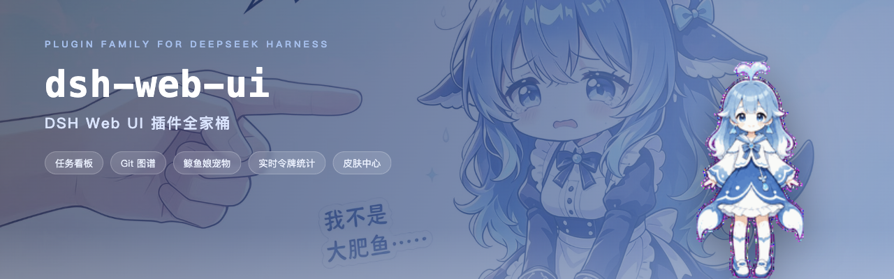
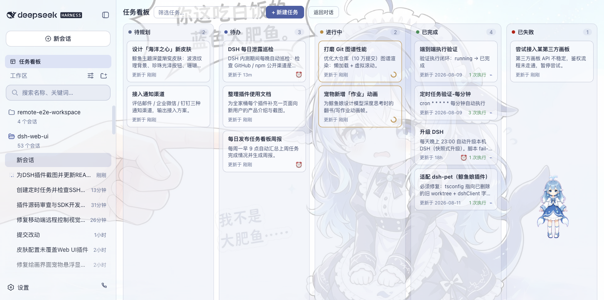
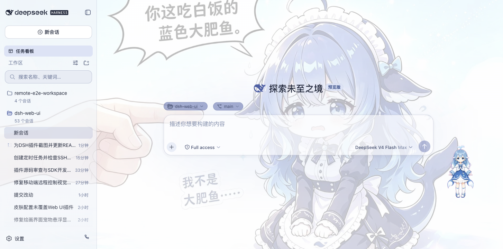
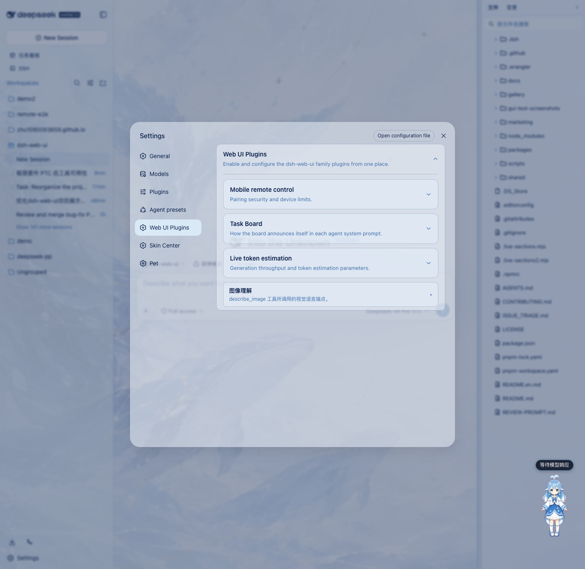
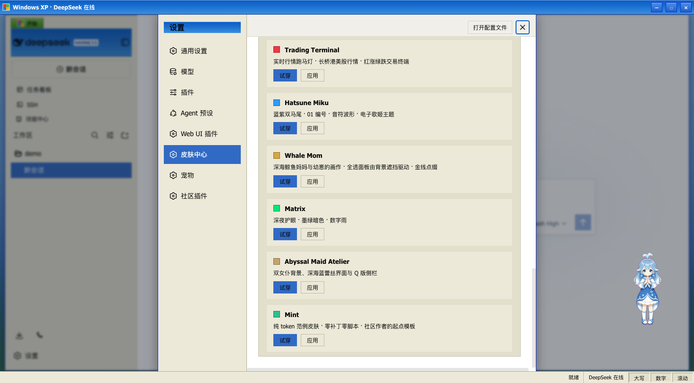
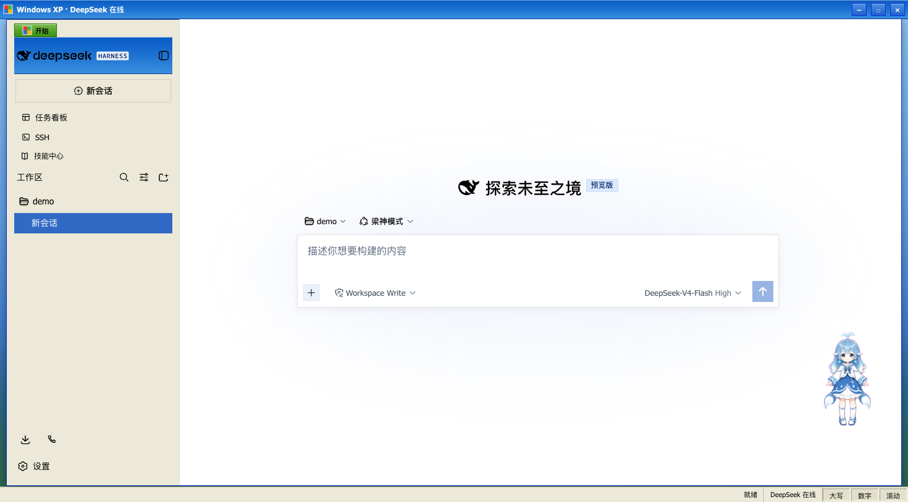
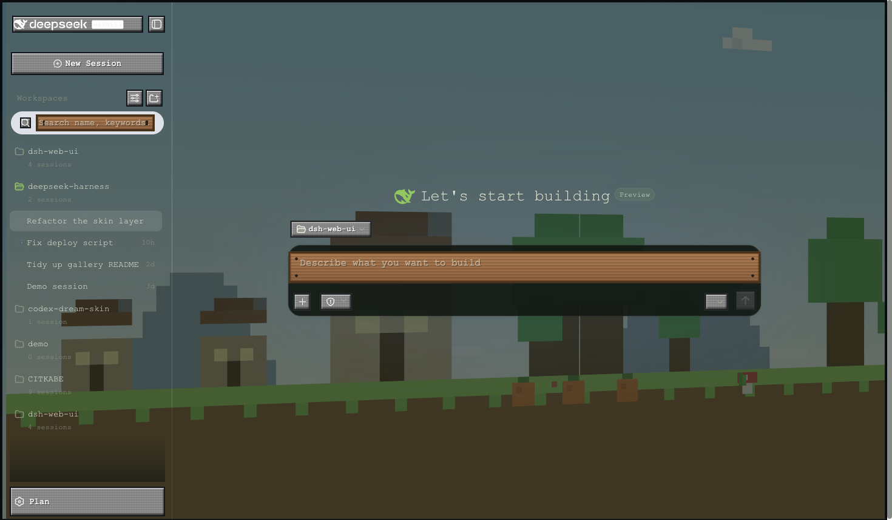
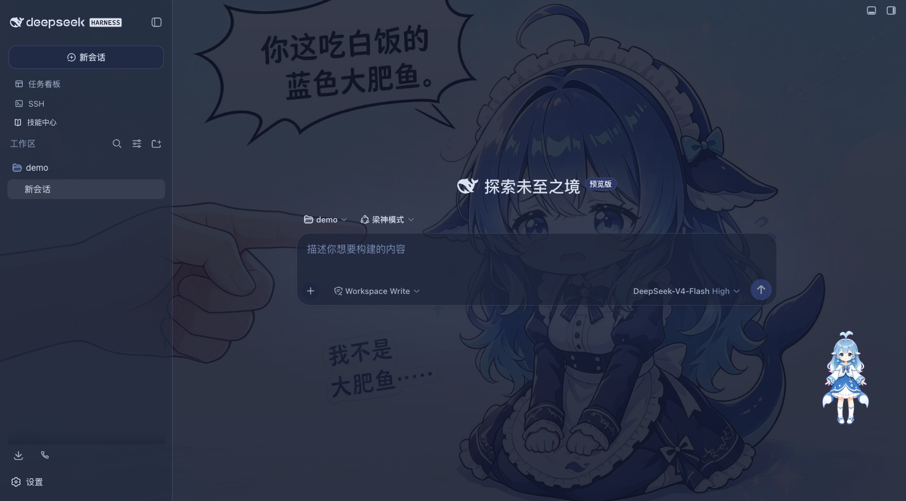

# dsh-web-ui · DSH Web UI

中文 | [English](README.en.md)

dsh-web-ui 是 DeepSeek Harness（DSH）Web UI 的插件与皮肤集合：任务看板、Git 图谱、鲸鱼娘宠物、实时令牌统计，以及皮肤中心。所有插件既可独立安装，也可通过聚合包一次装齐。

## 功能插件

### 任务看板

在侧边栏点击「任务看板」进入。任务按五列状态组织：待规划、待办、进行中、已完成、已失败。点击卡片上的「执行」，任务将由真实的 DSH 智能体会话执行，完成后状态自动回写；需要复盘时，可直接跳转到执行会话查看完整过程。

任务支持定时执行：在详情中配置 cron 表达式（如每天 23:00 自动升级 DSH、每周一 09:00 生成周报），到点自动开工，无需人工值守。

| 多列看板 | 定时执行 |
| --- | --- |
|  |  |

### Git 图谱

输入框上方的分支选择器，支持切换分支与查看提交历史；Git 图谱将分支泳道与提交历史可视化，仓库再大也能顺着时间线快速定位变更。

### 鲸鱼娘宠物

一只常驻界面的鲸鱼娘宠物，会跟随智能体的状态切换动画：思考、等待、工作、庆祝。点击可互动（摸头），投喂小鱼干可提升亲密度，陪伴度从幼鲸一路成长至「深海羁绊」。支持自定义名称、自由拖动位置，也可随时隐藏。

| 陪伴工作 | 互动面板 |
| --- | --- |
|  |  |

### 实时令牌统计

在输入框下方实时显示生成速度（TPS）、LLM 耗时、上下文占用、缓存命中率以及输入 / 输出 token 数，每次生成的用量一目了然。

### 设置中心

全部插件的开关与参数统一收纳于「设置 > 插件配置」，修改即时生效。

## 皮肤

皮肤中心提供 6 款皮肤，均支持先试穿再应用：试穿即时生效、退出完全还原，确认满意后一键应用。

### Windows XP（Luna）

还原 Luna 经典界面：蓝色渐变窗口条、绿色「开始」按钮、Bliss 蓝天桌面，全局直角风格。

### Minecraft 方块世界

以《我的世界》主界面为灵感：像素全景天空盒在界面后方缓慢旋转，按钮为灰石板样式，输入框为木告示牌样式。

### Blue Fantasy 蓝色幻想

鲸鱼插画铺于半透明面板之下，靛蓝色调色板贯穿全局，暗色主题下效果尤为突出。

其余三款：QQ2008 怀旧版（水晶蓝配色与企鹅元素）、同花顺风格（行情元素融入界面）、龙的传人（朱砂龙印主题）。

## 安装

通过聚合包一次装齐：`dsh-web-ui-all` 包含全部插件与皮肤，`dsh-skins` 仅包含皮肤。技术细节见 [docs/plugins.md](docs/plugins.md)。

## 来源与版权

| 包 | 来源 | 版权 |
| --- | --- | --- |
| dsh-task-board / dsh-git-graph / dsh-pet / dsh-remote-web-ui / dsh-live-stats | dsh-external 组织自有 | BSD-3-Clause（dsh-external contributors） |
| skins / dsh-skins / dsh-web-ui-all | 本仓库原生 | BSD-3-Clause |

迁入第三方代码必须保留 LICENSE 与署名；活跃且有上游的第三方优先 fork 或依赖引用，不搬代码。
