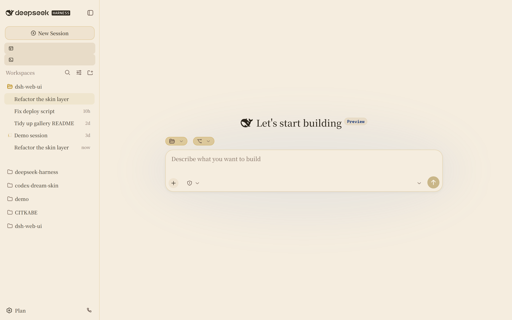
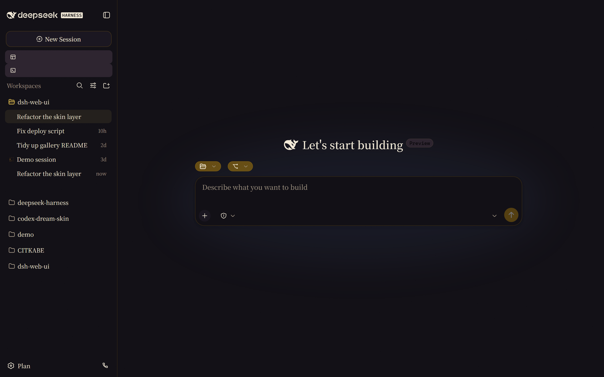

# dsh-client-ui-skin-jiangxiao · 姜晓·墨金卷轴主题皮肤

[English](README.md) | 中文

为 DeepSeek Harness（DSH）Web GUI 打造的唐风二次元主题皮肤：深色「墨金卷轴银杏」+ 浅色「宣纸梅花」双主题，按仓内 `skin-preview` 原型设计。除纯呈现层的 token 重映射外，本皮肤自带运行时层：FX 开关系统、带金色背光的角色浮层、DSH 会话状态跟随，以及设置卡内的素材导入引导。

- **配色**：墨黑底、鎏金流光、银杏飘落、朱砂印章（深色默认「墨金卷轴银杏」）；宣纸米白底、水墨晕染、梅花飘落（浅色变体「宣纸梅花」）
- **双主题**：深色为默认，浅色跟随 DSH 深浅信号自动切换（`body[data-ds-dark-theme]`）
- **token 级移植**：`--jx-*` 令牌按 skin-preview 令牌表（surface / text / gold / seal / cinnabar / ink-glow / 代码语法 / petal / motion / radius / shadow / layout）映射到 dsh 三层 token（`--dsw-static-*` / `--dsw-alias-*` / `--aion-*`），所有组件统一进入唐风墨染调。文字金用 `--jx-gold`（深）/ `--jx-gold-dim`（浅），均在每个 surface 上达 AA。
- **装饰级**：h1-h4 烫金箔（`background-clip: text`，`@supports` 兜底回退纯色 AA 金）、titlebar-v2 唐风云纹端饰 + 鎏金流光、金线滚动条、::selection、strong/b 亮金、:focus-visible outline、唐风代码块包边（`--jx-code-bg` / `--jx-code-border`）。无 chrome 条、无 favicon、不覆盖 document.title、不硬编码 button/input。
- **字体**：内置 2 个 woff2 字体（Ma Shan Zheng 楷体 + Noto Serif SC 宋体），离线可用，`@font-face` 含 `local()` 回退链
- **语法高亮**：语法 span 颜色保持上游 shiki 内联配色，皮肤只负责代码块包边

 · 

## 特性

- 纯呈现层 + 受守卫的运行时层：皮肤不注入自有服务，仅在 `slots` / `locale` / `sessions` 可用时消费它们
- `apply()` 只写自己会收回的东西，disposer 完整回收（body 属性、@font-face 样式、FX 类、浮层 DOM、会话订阅）
- 样式全部挂在 `body[data-dsh-jiangxiao]` 下（浅色变体 `:not([data-ds-dark-theme])`）
- 字体无静态资源文件：以 base64 data URL 内嵌进 JS bundle
- `prefers-reduced-motion` 下动效全关，并强制 FX 系统全关
- **FX 开关系统**：五效独立开关（shimmer 鎏金流光顶栏 + 金箔文字 / fall 银杏梅花飘落 8 片独立飘片 / grain 静态墨韵暗纹 / breathe 墨晕呼吸 / micro 印章脉冲 + hover 微交互），经 `html.fx-*` 类控制并持久化到 `localStorage('jx-fx')`。默认全开；可独立关；全关 = 与原版皮肤零视觉差异。设置卡暴露开关。
- **角色浮层**：右下角常驻的透明无底角色精灵，带金色发光背光（drop-shadow 光晕 + 呼吸 radial 光晕），素材按需从 `/pet/jiangxiao/<state>.webp` 加载（10 循环态 + 36 过渡段）。素材包缺失时浮层不渲染，无破图闪烁。
- **DSH 会话状态跟随**：当 `sessions` 服务可用时，浮层订阅当前会话快照，自动驱动角色在 idle / thinking / replying / working / error / permission / done / welcome 间切换。快照差分驱动状态转移；皮肤拆卸时释放全部订阅。
- **素材导入引导**：设置卡打开时探测 `HEAD /pet/jiangxiao/idle.webp`。探测失败（404 / 网络异常 / fetch 不可用）时展示导入引导；成功时展示 FX 开关。

## 环境要求

- Node.js ≥ 20
- pnpm ≥ 9
- 已运行 `dsh web` 的 DSH 环境（默认 `http://127.0.0.1:3080`）
- 可选：`dsh-pet` 插件提供 `/pet/jiangxiao/*.webp`，以启用角色浮层与状态跟随

## 构建与测试

```bash
pnpm install     # 安装依赖（自动执行 prepare 构建）
pnpm build       # 构建 lib/index.js + lib/client.js
pnpm test        # apply/dispose + 浮层 + FX + 状态 + 跟随 + 设置卡契约测试
```

构建产物 `lib/` 已随仓库提交，克隆后即使跳过构建也可安装；但建议完整构建一次。

## 安装到 DSH

```bash
dsh plugin --profile web add "link:<本仓库绝对路径>"
```

- 路径含空格（Windows）：`dsh plugin add` 会把含空格的参数拆断，请改用：

  ```bash
  cd ~/.dsh/profiles/web
  pnpm add "link:<本仓库绝对路径>"
  ```

  然后把 `@linxin666/dsh-client-ui-skin-jiangxiao` 追加到 `~/.dsh/profiles/web/package.json` 的 `dsh.profile.bundles` 数组。

- 安装后重启 `dsh web`，强制刷新页面（Ctrl+Shift+R）。

## 配置

### FX 开关

五效持久化在 `localStorage` 的 `jx-fx` 键下，JSON 对象：

```json
{ "shimmer": true, "fall": true, "grain": true, "breathe": true, "micro": true }
```

将任一键置 `false` 即关闭该效，或用设置卡开关。全部置 `false` 时皮肤与原版视觉完全一致（`<html>` 无任何 `fx-*` 类）。`prefers-reduced-motion: reduce` 强制五效全 `false`，无视存储值。

### 角色浮层素材

浮层从 `/pet/jiangxiao/` 加载精灵，预期布局（46 文件）：

- 10 循环态：`idle.webp`、`thinking.webp`、`reading.webp`、`replying.webp`、`working.webp`、`error.webp`、`welcome.webp`、`done.webp`、`permission.webp`、`listening.webp`
- 36 过渡段：`transition-<from>-<to>.webp`（idle 枢纽到 9 个非 idle 核心态的正反向，加 thinking <-> replying 直连）

当探测 `HEAD /pet/jiangxiao/idle.webp` 返回 404 或失败时，浮层不渲染，设置卡展示导入引导而非 FX 开关。

### 设置卡

当 `slots` 服务可用时注册一级设置区（`skin-jiangxiao`，order 125）。素材就绪时展示 FX 开关，素材缺失时展示导入引导。

## 切换皮肤

皮肤启用互斥，通过 `scripts/dsh-skin` 管理（写入当前 Web profile 的 `<harness-home>/profiles/<profile>/cordis.patch.yml` managed 区段 + profile 链接）：

```bash
dsh-skin use jiangxiao   # 启用本皮肤
dsh-skin use official    # 恢复官方默认外观
dsh-skin list            # 查看皮肤与当前激活项
```

切换后 config watcher 会在几秒内热重载，刷新页面即可生效。

## 对比度门禁

`scripts/check-jiangxiao-contrast.mjs` 解析 `jiangxiao.module.css` 中的 `--jx-text-*` / `--jx-surface-*` 字面量（深浅双套），按 WCAG 2.1 对比度公式在构建时校验：

- `--jx-text-strong` / `--jx-text-base` 与文字金令牌（深色 `--jx-gold` / 浅色 `--jx-gold-dim`）在 `--jx-surface-0` / `-1` / `-2` / `-3` 上 >= 4.5:1
- `--jx-text-weak` / `--jx-text-faint` >= 3:1

门禁接入 `pnpm test:scripts`（CI），任何使对比度跌破 AA 的颜色回退都会变红。

## 已知限制

- 内置 woff2 字体使 `lib/client.js` 增加约 4 MB（base64 较二进制放大 1.33×）；代价换来离线可用、无需外部字体 CDN。
- 本皮肤重映射 dsh 三层 token 体系；绕过 token 硬编码颜色的组件不会进入唐风调。
- 角色浮层与状态跟随需 `dsh-pet` 插件提供 `/pet/jiangxiao/*.webp`。缺失时皮肤优雅降级为纯呈现外观（无浮层、无状态跟随，设置卡展示导入引导）。
- 浮层精灵集（46 个 webp）不随皮肤包分发，须由 `dsh-pet` 或等价静态服务器提供。源码树中的 `assets/character/` 目录是规范参考集。

## License

BSD-3-Clause
